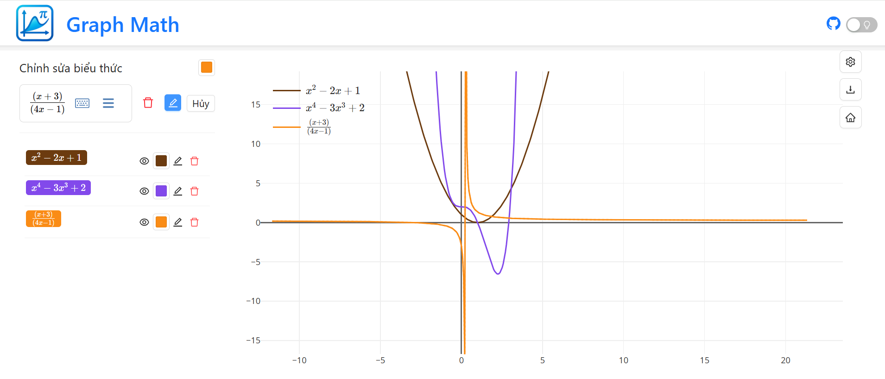

<h1 align="center">
  Graph Math - Interactive Function
  <br>
  
</h1>
<div align="center">


</div>

## Project Overview

Graph Math is a lightweight yet powerful graphing calculator built with React 19 + TypeScript. It lets you visualize mathematical functions instantly with an intuitive UI and supports advanced expression parsing, history management, and beautiful plotting through Plotly.js.

**Core Features:**

- **Live Plotting** – Real-time graph updates as you type
- **Multiple Chart Types** – Line, scatter, bar, polar …
- **Expression Support** – MathLive input & KaTeX display
- **Graph Library** – Save, rename, and revisit your favourite graphs
- **Theme Switch** – Light / Dark modes
- **Responsive Design** – Works seamlessly on desktop & mobile

## Quick Start

### 1. Clone the Repository

```bash
git clone https://github.com/tinh2044/Graph-Math.git
cd Graph-Math
```

### 2. Install Dependencies

```bash
npm install
```

### 3. Run in Development Mode

```bash
npm run dev
```

The app will be available at `http://localhost:5173`.

### 4. Production Build

```bash
npm run build
npm run preview
```

## Project Structure

```text
src/
├── components/     # Reusable UI components
├── Layout/         # Layout wrappers
├── hooks/          # Custom React hooks
├── context/        # Context providers
├── redux/          # Redux slices & store
├── utils/          # Helper utilities
├── types/          # TS types
└── App.tsx         # Entry component
```

## Testing

Graph Math uses **Jest** + **Testing Library** with `ts-jest` for TypeScript support.

```bash
# Run tests once with coverage
npm test

# Watch mode
npm test -- --watch
```

Coverage reports will appear in the `coverage/` directory.

## Contributing

Contributions are welcome! Fork the repo and open a pull request.

1. Fork the project
2. Create your feature branch: `git checkout -b feature/awesome-feature`
3. Commit your changes: `git commit -m 'Add awesome feature'`
4. Push to the branch: `git push origin feature/awesome-feature`
5. Open a Pull Request

## License

This project is licensed under the MIT License – see the [LICENSE](LICENSE) file for details.

<div align="center">
  <strong>⭐  If you find this project useful, please star the repo!</strong>
</div>

## Author

* **Nguyễn Chí Tình** – [GitHub Profile](https://github.com/tinh2044)